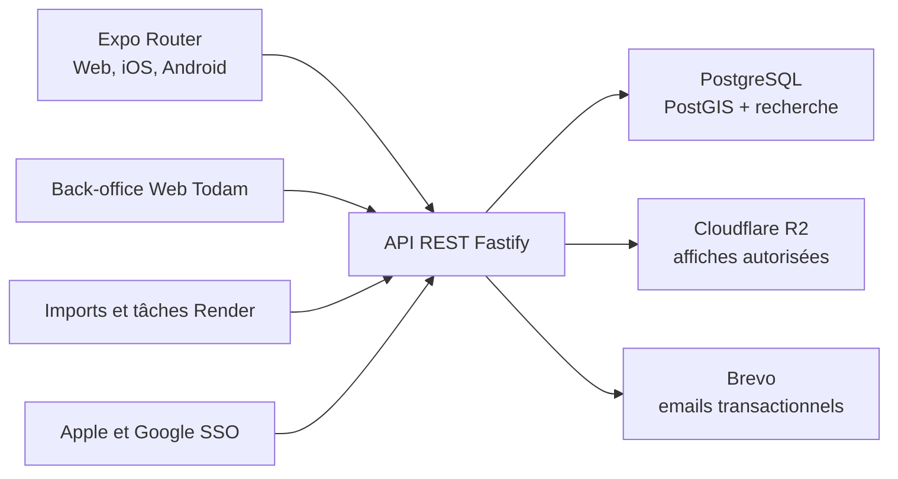

# Architecture technique de Todam

## 1. Architecture retenue

Todam sera un monorepo TypeScript « configuration as code » :

- **Frontend** : Expo Router + React Native Web.
- **Backend** : Node.js TypeScript + Fastify.
- **Contrats** : Zod + OpenAPI, avec client TypeScript généré pour Expo.
- **Base** : PostgreSQL sur Render, pilotée par Drizzle et des migrations versionnées.
- **Authentification** : Better Auth, compatible Expo Web/natif, avec Apple, Google et connexion par email ou nom d'utilisateur avec mot de passe.
- **Infrastructure** : Render pour le Web, l’API et PostgreSQL ; Cloudflare R2 pour les images.
- **Pas de Strapi ni Supabase** : aucun rôle, token ou réglage métier ne dépendra d’une console propriétaire.

Structure prévue :

- `apps/todam` : application Expo universelle et back-office Web protégé.
- `apps/api` : API Fastify et commandes d’administration.
- `apps/jobs` : imports et tâches planifiées, activés progressivement.
- `packages/contracts` : schémas Zod et client OpenAPI.
- `packages/domain` : règles métier indépendantes du transport.
- `packages/database` : schéma Drizzle, migrations et seeds.
- `packages/design-system` : tokens Todam et composants partagés.

Expo prend officiellement en charge les monorepos pnpm et le partage entre Web, Android et iOS. [Documentation Expo monorepo](https://docs.expo.dev/guides/monorepos/)

## 2. Frontend Expo universel

- Expo Router avec routes typées, TypeScript strict et navigation adaptée :
  - barre inférieure sur mobile ;
  - navigation supérieure sur Web ;
  - mêmes URLs publiques pour œuvres, spectacles, artistes, lieux et profils.
- Design system Todam construit sur les primitives React Native, avec tokens centralisés et NativeWind pour le responsive.
- TanStack Query pour les données serveur, React Hook Form + Zod pour les formulaires et état local minimal.
- Composants `.web.tsx` et `.native.tsx` uniquement lorsque la plateforme le justifie :
  - carte MapLibre Web et adaptateur natif ;
  - tableaux/statistiques accessibles spécifiques au Web ;
  - onglets et interactions mobiles natives.
- Back-office disponible sous `/admin` sur le Web uniquement :
  - catalogue et taxonomie ;
  - validation/fusion des suggestions ;
  - imports ;
  - modération, signalements et audit ;
  - gestion des rôles des comptes.
- WCAG 2.2 AA : HTML sémantique sur les pages Web spécifiques, alternatives aux cartes, tableaux accompagnant les graphiques et tests clavier/lecteur d’écran.

Le Web utilisera le rendu statique stable d’Expo. Les pages dynamiques connues seront générées avec `generateStaticParams`. Toute publication de catalogue déclenchera une reconstruction du site. Le SSR Expo étant encore marqué alpha, il ne sera pas une dépendance du MVP. [Rendu statique](https://docs.expo.dev/router/web/static-rendering/), [état du SSR](https://docs.expo.dev/router/web/server-rendering/)

## 3. Backend, données et interfaces

### API

API REST versionnée sous `/v1`, documentée sous `/openapi.json` :

- `/auth/*` : Better Auth, Apple, Google, connexion par email ou nom d'utilisateur, vérification et réinitialisation.
- `/catalog/*` : œuvres, spectacles, représentations, lieux, artistes et genres.
- `/search` et `/discover` : recherche, carte, programmation et tendances.
- `/me/*` : statut Vu, notes, critiques, À voir, listes, historique et export.
- `/profiles/*` : profil public, abonnements et activité visible.
- `/suggestions/*` : création et suivi des fiches provisoires.
- `/admin/*` : validation, fusion, modération, imports et audit.

Conventions :

- pagination par curseur ;
- erreurs au format Problem Details ;
- dates stockées en UTC, avec fuseau du lieu pour les représentations ;
- identifiants UUID et slugs publics stables ;
- transactions PostgreSQL pour chaque action modifiant plusieurs objets.

### Types et règles publiques

- `Role = member | trusted_contributor | admin`.
- `Discipline = theatre | opera | ballet`.
- Une note est un entier de 1 à 10, unique par membre et spectacle.
- Une note crée le statut Vu si nécessaire et retire le spectacle de « À voir » dans la même transaction.
- Le frontend MVP expose un seul statut Vu par spectacle ; le détail des séances reste une capacité backend non exposée.
- Les rôles et permissions sont déclarés dans le code et couverts par une matrice de tests.
- Aucun secret permanent n’est embarqué dans Expo : session HTTP sécurisée sur le Web et stockage sécurisé Expo sur mobile.
- Apple et Google SSO sont proposés avec une connexion par email ou nom d'utilisateur avec mot de passe en alternative.
- L’adresse email doit être vérifiée pour qu’une note influence une moyenne ; les emails SSO vérifiés sont acceptés.
- L’âge est traité par une déclaration « J’ai 15 ans ou plus », sans conserver inutilement une date de naissance.

### PostgreSQL

Extensions prévues :

- PostGIS pour lieux, distances et carte ;
- `unaccent` et `pg_trgm` pour fautes et accents ;
- recherche plein texte configurée en français.

Entités principales : utilisateurs/profils, œuvres, spectacles, représentations, lieux, artistes, crédits, disciplines, genres, traces personnelles du statut Vu, notes, critiques, À voir, listes ordonnées, abonnements, blocages, suggestions, sources, imports, signalements et actions de modération.

La recherche reste dans PostgreSQL jusqu’à ce que les mesures démontrent un besoin réel d’un moteur séparé.

### Administration sans console cachée

Commandes versionnées :

- `db:migrate`
- `db:seed`
- `admin:grant`
- `admin:revoke`
- `import:venues`
- `import:openagenda`
- `catalog:rebuild-search`
- `web:rebuild`
- `smoke:production`

Le premier compte se connecte normalement, puis `admin:grant` lui attribue le rôle administrateur. Les credentials Apple, Google, Brevo et R2 nécessitent une création initiale chez leurs fournisseurs, mais toutes les règles Todam restent dans le dépôt.

## 4. Déploiement et coûts

Le `render.yaml` racine décrira le site statique, l’API, PostgreSQL, les contrôles de santé et les variables attendues. Les valeurs secrètes seront injectées séparément.

| Ressource | Phase personnelle | Petite ouverture publique |
|---|---:|---:|
| Expo Web statique | 0 $ | 0 $ |
| API Render Starter | 7 $/mois | 7 $/mois |
| PostgreSQL 256 Mo | 6 $/mois | À réserver au test/bêta légère |
| PostgreSQL 1 Go | — | 19 $/mois |
| R2 | 0 $ dans le quota gratuit | Selon stockage |
| Expo EAS | 0 $ dans le quota gratuit | 0–19 $ selon usage |
| Total indicatif | **13–15 $/mois** | **≈ 26 $/mois** avec une base 1 Go |

Render est donc réellement économique au démarrage, mais son PostgreSQL à 6 $ ne contient que 256 Mo. Une comparaison équitable avec Supabase Pro doit utiliser la base Render 1 Go, ce qui place Render autour de 26 $ avant stockage. [Tarification Render](https://render.com/pricing), [tarification Supabase](https://supabase.com/pricing)

Déploiement progressif :

1. **Usage personnel Web** : site statique, API, petite base, saisie catalogue par le back-office.
2. **Bêta publique** : reconstruction automatique des fiches indexables, imports contrôlés, modération, sauvegardes et base renforcée.
3. **Applications mobiles** : builds EAS du même frontend, liens profonds, Apple/Google SSO et notifications.
4. **Échelle ultérieure** : SSR Expo seulement lorsqu’il sera stable, ou ajout d’un service Web dédié si les reconstructions deviennent trop longues.

Les frais des stores, du domaine et les dépassements email ne sont pas inclus.

## 5. Validation et exploitation

- Vitest pour domaine, contrats, statistiques et permissions.
- Tests d’intégration sur un vrai PostgreSQL éphémère.
- Playwright pour les parcours Web et le back-office.
- Maestro pour iOS/Android lorsque la phase mobile commence.
- Tests automatiques de confidentialité pour chaque rôle et chaque visibilité.
- Tests WCAG avec axe, clavier et résumés accessibles des graphiques.
- Validation des scénarios de la fiche produit : note en moins de dix secondes, statut Vu simple, retrait de « À voir », seuil des moyennes, suggestion fusionnée sans perte de note et export complet.
- Logs JSON Pino, Sentry frontend/backend, endpoints `/health/live` et `/health/ready`.
- Sauvegardes Render et exercice documenté de restauration avant ouverture publique.
- `AGENTS.md` précisera l’architecture, les commandes, les règles de sécurité et la définition de « terminé » afin que Codex puisse construire, tester et diagnostiquer le projet de façon reproductible.
- Toute modification de schéma passe par une migration relue et testée ; aucune modification directe de production n’est considérée comme source de vérité.

Hypothèses verrouillées : application française, données centrées sur la France, Web personnel en premier, application grand public universelle ensuite, architecture sans Strapi, et aucune implémentation à effectuer tant qu’une phase de construction n’est pas explicitement demandée.
